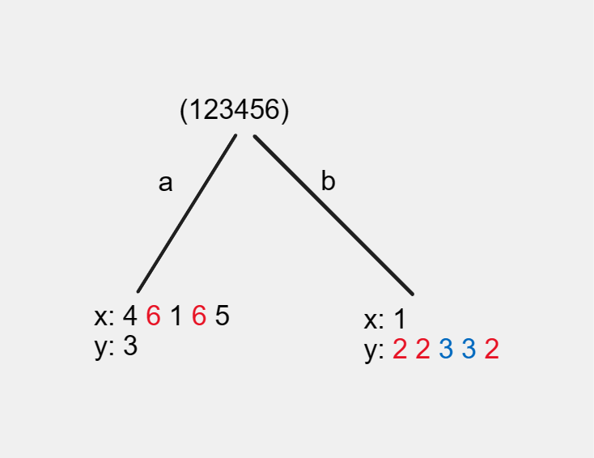
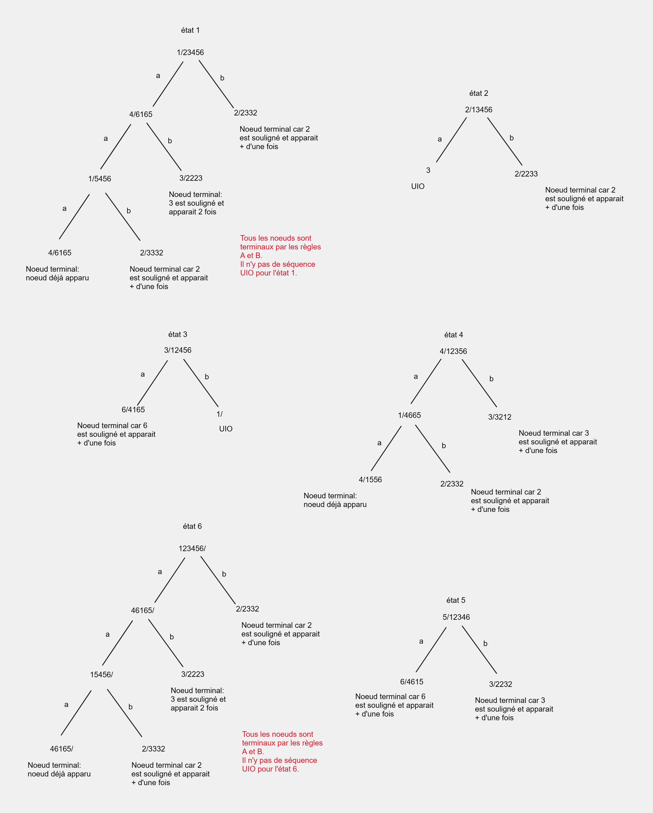
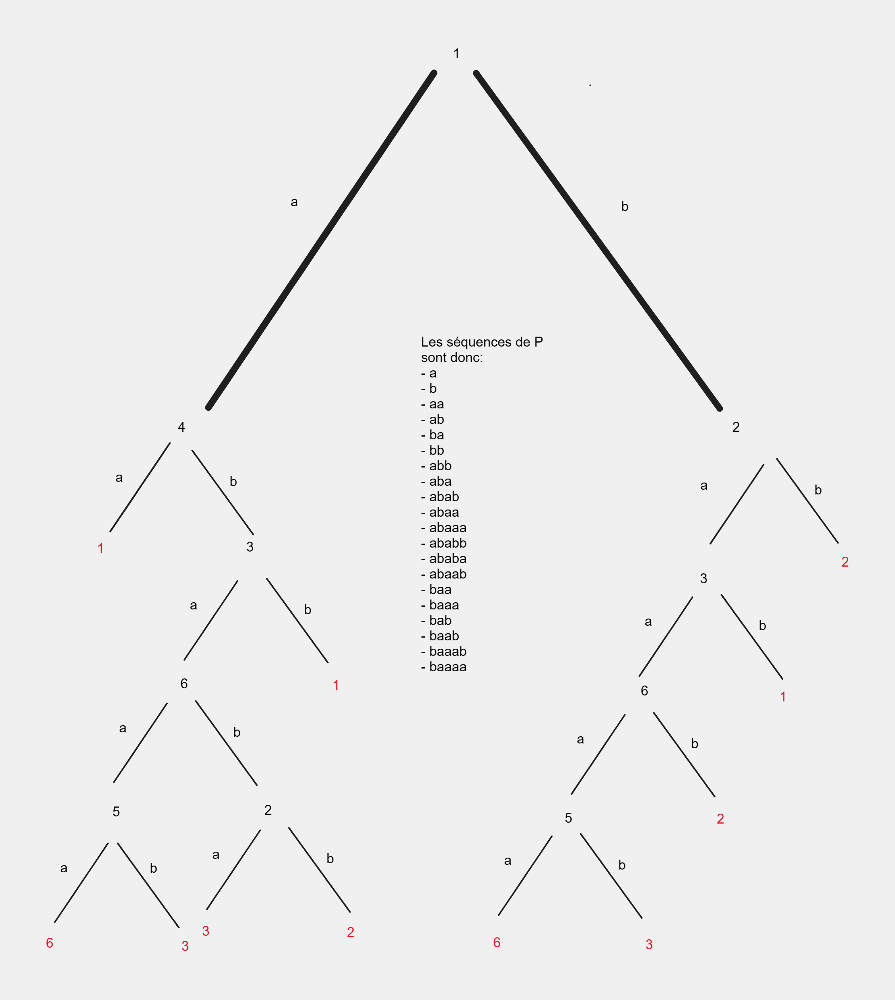

# TD Modélisation et Vérification

## 1. Notions de bases (rappels et/ou introduction)

### 1.1 Question de cours

Définition d'une machine a état fini (FSM) de Mealy :

C'est un automate fin avec sorties utilisé pour concevoir des programmes. Les sorties dépendent des états courants et des symboles d'entrée.\

a) Une FSM est déterministe lorsque la relation de transition est une fonction S x I => S. C'est-à-dire pour chaque état et chaque symbole d'entrée, il existe un seul état suivant.

b) Une FSM est partiellement specifiée quand certaines transitions ne sont pas définies pour certains états et symboles.

c) Une FSM est fortement connectée lorsque tous ses états sont accessibles les un des autres via des transitions.

d) Une FSM est minimale si elle a le nombre minimum d'états nécéssaires pour représenter le comportement spécifié.

## 2. Modélisation avec les automates

### Exercice 1

#### Question 1

Cet automate semble décrire un horloge à affichage numérique (hh:mm).\
L'état initial est l'état `E0`. On doit d'abord afficher les heures.\
Si le premier chiffe de l'heure actuelle est 0 ou 1 (< 20h) on part vers l'état `H1`.\
Sinon on part vers l'état `H2`.\
Dans l'état `H1`on peut saisir les unités des heures entre 0 et 9 (00h à 19h).\
Dans l'état `H2`on peut saisir les unités des heures entre 0 et 3 (20h à 23h).\
On passe ensuite à l'état `H`quand on a fini d'afficher les heures.\
On affiche le caractère `:` et on passe à l'état `M1` pour afficher les dizaines des minutes.\
On affiche un chiffre entre 0 et 5 pour les dizaines et on passe à l'état `M2`.\
Finalement on saisit la valeur des unités des minutes entre 0 et 9 et on arrive à l'état final `M`.\

#### Question 2

S (états) = {E0, H1, H2, H, M1, M2, M}

I (alphabet) = {0,1,2,3,4,5,6,7,8,9,:}

delta (transitions) = {(E0,H1,{0,1}), (E0, H2, {2}), (H1,H, {0..9}), (H2,H, {0,1,2,3}), (H,M1, {:}), (M1, M2, {0..5}), (M2, M, {0..9})}

S0 (état initial) = {E0}

Sf (état final) = {M}

| State | 0   | 1   | 2   | 3   | 4   | 5   | 6   | 7   | 8   | 9   | :   |
| ----- | --- | --- | --- | --- | --- | --- | --- | --- | --- | --- | --- |
| E0    | H1  | H1  | H2  |     |     |     |     |     |     |     |     |
| H1    | H   | H   | H   | H   | H   | H   | H   | H   | H   | H   |     |
| H2    | H   | H   | H   | H   |     |     |     |     |     |     |     |
| H     |     |     |     |     |     |     |     |     |     |     | M1  |
| M1    | M2  | M2  | M2  | M2  | M2  | M2  |     |     |     |     |     |
| M2    | M   | M   | M   | M   | M   | M   | M   | M   | M   | M   |     |
| M     |     |     |     |     |     |     |     |     |     |     |     |

#### Question 3

```JavaScript
function automate(input: string){ // Exemple: "13:08"
  let currentNode: Etat = E0;
  for (let char in input) { // On itère sur les caractères de l'entrée
    const transition = currentNode.transitions[char];
    currentNode = transition.to;
    console.log(`${currentNode} ${char}`);
  }

  if (currentNode == EF) {
    print("La suite de caractères en entrée est reconnue")
  }else{
    throw new Error("Chaine de caractères non reconnue");
  }
}
```

#### Question 4

Pour traiter les erreurs, on peut en cas de lecture d'un caractère inattentdu faire une transition vers l'état courant. Ainsi on laisse une autre chance de lire un caractère valide.

#### Question 5

```javascript
class Etat {
  constructor(final) {
    this.final = final;
    this.transitions = new Map();
  }

  addTransition(action, etatSuivant) {
    this.transitions.set(action, etatSuivant);
  }

  getTransitions() {
    return this.transitions;
  }

  isFinal() {
    return this.final;
  }
}

class Automate {
  constructor(alphabet, etats, etatInitial, etatsFinaux) {
    this.alphabet = alphabet;
    this.etats = etats;
    this.etatInitial = etatInitial;
    this.etatsFinaux = etatsFinaux;
  }

  transition(etatCourant, action) {
    const transitions = etatCourant.getTransitions();
    return transitions.get(action);
  }

  getEtatInitial() {
    return this.etatInitial;
  }

  getEtatsFinaux() {
    return this.etatsFinaux;
  }
}

class MonApplication {
  constructor() {
    const alphabet = ["0", "1", "2"];
    const etatH1 = new Etat(false);
    const etatH2 = new Etat(true);
    etatH1.addTransition("0", etatH1);
    etatH1.addTransition("1", etatH1);
    etatH1.addTransition("2", etatH2);
    const etats = [etatH1, etatH2];
    const etatInitial = etatH1;
    const etatsFinaux = [etatH2];
    this.automate = new Automate(alphabet, etats, etatInitial, etatsFinaux);
  }

  run() {
    const readline = require("readline").createInterface({
      input: process.stdin,
      output: process.stdout,
    });
    let etatCourant = this.automate.getEtatInitial();

    readline.question(
      "Entrez une chaîne de caractères (ou 'exit' pour quitter) : ",
      (chaine) => {
        while (chaine !== "exit") {
          for (let i = 0; i < chaine.length; i++) {
            const action = chaine[i];
            etatCourant = this.automate.transition(etatCourant, action);
            if (etatCourant == null) {
              console.log("Chaîne invalide !");
              break;
            }
          }

          if (this.automate.getEtatsFinaux().includes(etatCourant)) {
            console.log("Chaîne valide !");
          } else {
            console.log("Chaîne invalide !");
          }

          etatCourant = this.automate.getEtatInitial();
          readline.question(
            "Entrez une chaîne de caractères (ou 'exit' pour quitter) : ",
            (chaine) => {}
          );
        }

        readline.close();
      }
    );
  }
}

const app = new MonApplication();
app.run();
```

## 3. Methodes de génération de tests à partir de machines à états finis

### Exercice 1

#### Question 1

| Input (TS) | ababab |
| ---------- | ------ |
| Output     | 010010 |

#### Question 2

| State        | S0  | S1  | S2  | S0  | S1  | S2  | S0  | S1  | S2  |
| ------------ | --- | --- | --- | --- | --- | --- | --- | --- | --- |
| Input (TS)   | a   | a   | a   | b   | b   | b   | ab  | ab  | ab  |
| Output       | 0   | 1   | 0   | 1   | 0   | 0   | 01  | 10  | 00  |
| Output State | S0  | S1  | S2  | S2  | S0  | S1  | S2  | S0  | S1  |

DS = a.b

#### Question 3

| Input (TS) | ababab |
| ---------- | ------ |
| Output     | 010010 |

La sortie est correcte cependant à la fin du tour de tranisition on ne revient pas à l'état initial. On peut considérer que l'implémentation est mauvaise.

#### Question 4

| State        | S0  | S1  | S2  |
| ------------ | --- | --- | --- |
| Input (TS)   | ab  | ab  | ab  |
| Output       | 01  | 10  | 00  |
| Output State | S2  | S2  | S1  |

Lorsqu'on applique la DS on voit que chacun des états produits une sortie différente. Cependant si on regarde les états de sortie on voit que S1 fini dans S2 alors que dans l'implémentation S1 fini dans S0. On peut conclure que l'implémentation I est fausse.

## Exercice 2

### Question 1

| Input (TS) | ababcbcca |
| ---------- | --------- |
| Output     | 000000011 |

### Question 2

| State  | S0  | S1  | S2  | S0  | S1  | S2  | S0  | S1  | S2  |
| ------ | --- | --- | --- | --- | --- | --- | --- | --- | --- |
| Input  | c   | c   | c   | ba  | ba  | ba  | a   | a   | a   |
| Output | 1   | 0   | 0   | 00  | 01  | 00  | 0   | 0   | 1   |

Séquences UIO :

S0 = c
S1 = ba
S2 = a

## Exercice 3

### Question 1

Nous avons deux sorties différentes pour la même entrée, le FSM n'est pas déterministe, nous ne pouvons donc pas appliquer la méthode W ni la méthode UIO.
Cependant on considère que la transition b/x entre S5 et S1 est inversé.

m = 5
inputs = {a,b,c}
outputs = {x,y,z}

| Current State | Output |     |     | Next State |     |     |
| ------------- | ------ | --- | --- | ---------- | --- | --- |
|               | a      | b   | c   | a          | b   | c   |
| S1            | x      | x   | z   | S5         | S5  | S1  |
| S2            | x      | y   | x   | S5         | S2  | S3  |
| S3            | x      | x   | y   | S3         | S5  | S4  |
| S4            | x      | z   | y   | S4         | S5  | S4  |
| S5            | y      | y   | y   | S1         | S1  | S4  |

Séquences distinctives :

s1, s2 -> b
s1, s3 -> c
s1, s4 -> b
s1, s5 -> a

s2, s3 -> b
s2, s4 -> b
s2, s5 -> c

s3, s4 -> b
s3, s5 -> a

s4, s5 -> a

W = {a, b, c}

Séquences (P)UIO :

S1 = c
S2 = c
S3 = bc
S4 = b
S5 = a

### Question 2

On utilise la W-Method

L'arbre de test :


TS pour la transition (S2, b/y, S2) :

TS = {abba, abbb, abbc, bbba, bbbb, bbbc}

## Exercice 4

Pour l'état 2 nous avons deux transitions différentes pour la même entrée a, le FSM n'est pas déterministe, nous ne pouvons donc pas appliquer la méthode DS ni la méthode W.

## Exercice 5

### Question 1

- On essaye d'utiliser la méthode DS :


Pour la méthode DS (distinction sequence) on identifie des multisets pour chacune des branches de l'arbre. Il n'y a donc pas de séquence ded distinction pour cette FSM.

- Méthode W :

1er Tableau :

| CurrentState | Output |     | NextState |     |
| ------------ | ------ | --- | --------- | --- |
|              | a      | b   | a         | b   |
| 1            | x      | y   | 4         | 2   |
| 2            | y      | y   | 3         | 2   |
| 3            | x      | x   | 6         | 1   |
| 4            | x      | y   | 1         | 3   |
| 5            | x      | y   | 6         | 3   |
| 6            | x      | y   | 5         | 2   |

On regroupe les transition ayant les mêmes sorties :

| SubGroup | CurrentState | Output |     | NextState |     |
| -------- | ------------ | ------ | --- | --------- | --- |
|          |              | a      | b   | a         | b   |
| 1        | 2            | y      | y   | 3         | 2   |
| 2        | 3            | x      | x   | 6         | 1   |
| 3        | 1            | x      | y   | 4         | 2   |
| 3        | 4            | x      | y   | 1         | 3   |
| 3        | 5            | x      | y   | 6         | 3   |
| 3        | 6            | x      | y   | 5         | 2   |

On réécrit le tableau on supprimant les colonnes de sorties, et on rajoute à chaque état de sortie le numéro du sous groupe auquel il appartient :

P1

| SubGroup | CurrentState | NextState |     |
| -------- | ------------ | --------- | --- |
|          |              | a         | b   |
| 1        | 2            | 32        | 21  |
| 2        | 3            | 63        | 13  |
| 3        | 1            | 43        | 21  |
| 3        | 4            | 13        | 32  |
| 3        | 5            | 63        | 32  |
| 3        | 6            | 53        | 21  |

On réécrit de nouveau le tableau en regroupant les lignes dont les deuxièmes chiffres des états de sorties sont les mêmes :

P2

| SubGroup | CurrentState | NextState |     |
| -------- | ------------ | --------- | --- |
|          |              | a         | b   |
| 1        | 2            | 32        | 21  |
| 2        | 3            | 63        | 13  |
| 3        | 1            | 44        | 21  |
| 3        | 6            | 54        | 21  |
| 4        | 4            | 13        | 32  |
| 4        | 5            | 63        | 32  |

Séquences distinctives :\
1 4 -> b\
1 5 -> b\
4 5 -> b\
5 6 -> b

Ensemble de caractérisation (W) :\
Impossible ! Nous n'avons pas une séquence distinctive pour chaque paire d'états.

PUIOs :



Nous avons trouvé deux UIO :

Pour l'état 2 : a\
Pour l'état 3 : b

Pour P :



P = {€,a,b,aa,ab,ba,bb,abb,aba,abab,abaa,abaaa,ababb,ababa,abaab,baa,baaa,bab,baab,baaab,baaaa}

### Question 2

On assume que m = n (le nombre d'états de la spécification est égale au nombre d'états de l'implémentation).

Donc Z = I^0.W = W

On suppose donc :

W = {b}

On concatenne W avec P :

TS = P.Z

On obtient :

TS = ["aab", "ab", "abaaab", "abaab", "abaabb", "abab", "ababab", "ababb", "ababbb", "abb", "abbb", "b", "ba", "baa", "baaaab", "baaab", "baaabb", "baab", "baabb", "bab", "baba", "babaa", "babaaa", "babaab", "babab", "bababa", "bababb", "babb", "bb", "bba", "bbaa", "bbaaa", "bbaaaa", "bbaaab", "bbaab", "bbab", "bbb"]

ou bien

TS = { aa, babaa }

## Exercice Bonus

```TypeScript
export class Result {
    constructor(public test: string, public output: string) {}
  }

export class NodeFSM {
id: number;
transitions: Map<string, Transition>;

constructor(id: number) {
    this.id = id;
    this.transitions = new Map<string, Transition>();
}

addTransition(transition: Transition) {
    this.transitions.set(transition.input, transition);
}

startTest(test: string): Result {
    let result: Result = new Result(test, "");
    let currentNode: NodeFSM = this;
    for (let i = 0; i < test.length; i++) {
    const input = test.charAt(i);
    const transition = currentNode.transitions.get(input);
    if (transition) {
        result.output = result.output.concat(transition.output);
        currentNode = transition.to;
    }
    }
    return result;
}

startTestSuit(testSuit: string[]): Result[] {
    let result: Result[] = [];
    for (let i = 0; i < testSuit.length; i++) {
    result.push(this.startTest(testSuit[i]));
    }

    return result;
}
}

export class Transition {
constructor(public to: NodeFSM, public input: string, public output: string) {}
}

export function concat(p: string[], z: string[]) {
const concatTab: string[] = [];

for (const value of p) {
    for (const value2 of z) {
    if (value) {
        concatTab.push(value2 ? value.concat(value2) : value);
    } else {
        concatTab.push(value2);
    }
    }
}

return concatTab.filter((v, i, a) => a.indexOf(v) === i);
}

function generateM1(): NodeFSM {
    const s1 = new NodeFSM(1);
    const s2 = new NodeFSM(2);
    const s3 = new NodeFSM(3);
    const s4 = new NodeFSM(4);
    const s5 = new NodeFSM(5);

    const t11 = new Transition(s1, "a", "0");
    const t12 = new Transition(s4, "b", "1");

    const t21 = new Transition(s3, "a", "0");
    const t22 = new Transition(s5, "b", "1");

    const t31 = new Transition(s1, "b", "1");
    const t32 = new Transition(s5, "a", "0");

    const t41 = new Transition(s4, "b", "1");
    const t42 = new Transition(s3, "a", "1");

    const t51 = new Transition(s2, "a", "1");
    const t52 = new Transition(s5, "b", "1");

    s1.addTransition(t11);
    s1.addTransition(t12);

    s2.addTransition(t21);
    s2.addTransition(t22);

    s3.addTransition(t31);
    s3.addTransition(t32);

    s4.addTransition(t41);
    s4.addTransition(t42);

    s5.addTransition(t51);
    s5.addTransition(t52);

    return s1;
  }

  function generateM(): NodeFSM {
    const s1 = new NodeFSM(1);
    const s2 = new NodeFSM(2);
    const s3 = new NodeFSM(3);
    const s4 = new NodeFSM(4);
    const s5 = new NodeFSM(5);

    const t11 = new Transition(s1, "a", "0");
    const t12 = new Transition(s4, "b", "1");

    const t21 = new Transition(s1, "a", "0");
    const t22 = new Transition(s5, "b", "1");

    const t31 = new Transition(s1, "b", "1");
    const t32 = new Transition(s5, "a", "0");

    const t41 = new Transition(s4, "b", "1");
    const t42 = new Transition(s3, "a", "1");

    const t51 = new Transition(s2, "a", "1");
    const t52 = new Transition(s5, "b", "1");

    s1.addTransition(t11);
    s1.addTransition(t12);

    s2.addTransition(t21);
    s2.addTransition(t22);

    s3.addTransition(t31);
    s3.addTransition(t32);

    s4.addTransition(t41);
    s4.addTransition(t42);

    s5.addTransition(t51);
    s5.addTransition(t52);

    return s1;
  }

  function generateM2(): NodeFSM {
    const s1 = new NodeFSM(1);
    const s2 = new NodeFSM(2);
    const s3 = new NodeFSM(3);
    const s4 = new NodeFSM(4);
    const s5 = new NodeFSM(5);

    const t11 = new Transition(s1, "a", "0");
    const t12 = new Transition(s4, "b", "1");

    const t21 = new Transition(s3, "a", "0");
    const t22 = new Transition(s5, "b", "1");

    const t31 = new Transition(s1, "b", "1");
    const t32 = new Transition(s5, "a", "0");

    const t41 = new Transition(s4, "b", "1");
    const t42 = new Transition(s3, "a", "1");

    const t51 = new Transition(s2, "a", "1");
    const t52 = new Transition(s5, "b", "0");

    s1.addTransition(t11);
    s1.addTransition(t12);

    s2.addTransition(t21);
    s2.addTransition(t22);

    s3.addTransition(t31);
    s3.addTransition(t32);

    s4.addTransition(t41);
    s4.addTransition(t42);

    s5.addTransition(t51);
    s5.addTransition(t52);

    return s1;
  }

  function compareOutputs(expected: Result[], observed: Result[]): boolean {
    for (let i = 0; i < expected.length; i++) {
      if (expected[i].output.length !== observed[i].output.length) {
        console.log("Expected: " + expected.length + " Observed: " + observed.length);
        return false;
      }

      for (let j = 0; j < expected[i].output.length; j++) {
        if (expected[i].output[j] !== observed[i].output[j]) {
          console.log("Expected: " + expected[i].output + " Observed: " + observed[i].output);
          console.log("Input expect " + expected[i].test);
          return false;
        }
      }
    }
    return true;
  }

  const m = generateM();
  const m1 = generateM1();
  const m2 = generateM2();

  const p: any = [null, "a", "b", "bb", "ba", "bab", "baa", "baab", "baaa", "baaab", "baaaa"];
  const z: any = ["a", "aa", "aaa", "baaa"];
  const ts = concat(p, z);

  const expectedOutput: Result[] = m.startTestSuit(ts);

  const observedOutputM1: Result[] = m1.startTestSuit(ts);

  const observedOutputM2: Result[] = m2.startTestSuit(ts);

  console.log("Compare M1 to M");
  const result = compareOutputs(expectedOutput, observedOutputM1);

  if (result) {
    console.log("success");
  } else {
    console.log("fail");
  }

  console.log("Compare M2 to M");
  const result2 = compareOutputs(expectedOutput, observedOutputM2);

  if (result2) {
    console.log("success");
  } else {
    console.log("fail");
  }


```

Sortie du programme :

Compare M1 to M\
Expected: 1101000 Observed: 1101001\
Input expect baaaaaa\
fail\
Compare M2 to M\
Expected: 1101100 Observed: 1100100\
Input expect baabaaa\
fail

L'output des implémentations M1 et M2 est différente de l'output de M.
